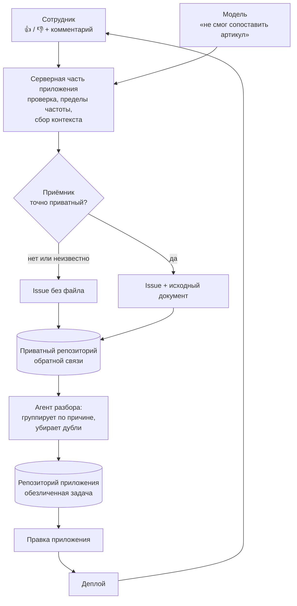

# Как я построил цикл обратной связи для приложения: от дизлайка до issue и доработки

Когда приложение начали тестировать пять сотрудников, обычный сбор обратной связи быстро перестал работать: жалобы были слишком абстрактными и воспроизвести ошибки было сложно. Я встроил в систему цикл, в котором пользователи и сама модель создают issues, сохраняют исходные документы и передают разработчику весь контекст для доработки.

Привет! Меня зовут Игорь, я партнёр Битрикс24 — разрабатываю библиотеки для пользовательских интерфейсов и SDK. Ещё у меня есть клиенты, для которых я занимаюсь технически сложными доработками и нестандартными кастомизациями Битрикс24.

Расскажу, как превратил обратную связь от пользователей и ИИ в удобный процесс тестирования и доработки приложения. Система сама собирает ошибки, сохраняет нужный контекст и помогает быстро находить проблемы, не собирая созвонов и почти не отвлекая сотрудников расспросами.

## Что в статье

- Исходная задача клиента: автоматизация документов по закупке
- Первая версия приложения работала плохо, но было неясно, что идёт не так
- Откуда появилась идея собирать обратную связь от ИИ и через ИИ
- Первая пользовательская механика: «нравится», «не нравится» и почему
- Дизлайки нашли ошибку не в коде, а в техническом задании
- Фидбэк от людей и от ИИ превращается в issues
- Корректировка 1: к отзыву прикладывается сам документ
- Корректировка 2: агент должен говорить конструктивно
- Вторая механика: автоматический отчёт для руководителя
- В чём я вижу главные особенности и плюсы такого решения

## Исходная задача клиента: автоматизация документов по закупке

У одного из моих давних клиентов есть отдел закупок.

Каждый день в отдел приходит примерно 50 документов от поставщиков: прайс-листы, электронные документы, сделанные на телефон сканы, ТТН и другие закупочные документы.

В одном таком документе может быть около 40 товарных позиций. Раньше сотрудники сидели и вручную искали каждую позицию, сопоставляли данные и переносили их в Битрикс24. Получалось 2000 позиций для ручной обработки. Клиент хотел автоматизировать процесс.

Я создал приложение, которое разбирало прайс или другой входящий документ, извлекало цены поставщика и распределяло данные по полям сделки в Битрикс24. Это работало так:

1. Пользователь загружает документ через форму.
2. Из файла извлекается текст — детерминированно: PDF разбирается как PDF, таблица как таблица, скан прогоняется через OCR.
3. Текст уходит в модель, и она возвращает строго JSON по заданной схеме.
4. Система создаёт сделку с номенклатурой — тоже детерминированно, без участия модели.

> **[ВИДЕО]** Демонстрация полного прохода: сотрудник выбирает документ, приложение его разбирает, в Битрикс24 появляется сделка с товарными строками.
> *Что показать: загрузка → ход разбора → готовая сделка с номенклатурой. Коротко, без звука, с тест-портала на синтетических документах — ни одного клиентского файла, домена или налогового номера. Это единственное место в статье, где читатель видит продукт в работе целиком; дальше идут только отдельные экраны.*

Внутри выполняется несколько проверок: найден ли контрагент, удалось ли сопоставить товар и найти цену.

Важно, что **модель отвечает ровно за один шаг из четырёх**. Вызов tool-less: на вход текст, на выход JSON, никаких инструментов у неё нет. Транспорт — обычный OpenAI-совместимый вызов, а провайдер переключается переменной окружения: по умолчанию **BitrixGPT** — модель работает в инфраструктуре Битрикс24, — резервный вариант **DeepSeek**. Один транспорт на всех, так что смена провайдера не трогает код.

Такая задача сложнее простого импорта строк, потому что у разных поставщиков одни и те же товары называются по-разному. Где-то сначала указан артикул, потом название; где-то порядок обратный; где-то артикул вообще вписан внутрь наименования после пометки «арт.».

Сопоставление при этом идёт **только по артикулу** — по названию мы не ищем принципиально. Название не идентификатор: одна и та же позиция у двух поставщиков написана по-разному, а похожие названия у разных товаров встречаются сплошь и рядом. И главное — ошибка такого сопоставления ничем себя не выдаёт: приложение не падает, предупреждения нет, в сделке просто оказывается не тот товар. Заметить это можно только сверкой с бумагой, то есть ровно той работой, которую мы убирали.

Поэтому позиция без артикула в сделку не попадает вовсе. Она перечисляется в отчёте о разборе и считается отдельным счётчиком — по нему видно, сколько позиций осталось на ручной ввод. Честный пробел лучше закрытой догадки.

А у сопоставленной позиции наименование берётся из карточки товара в Битрикс24, а не из документа. Иначе один и тот же товар в каждой сделке читался бы написанием очередного поставщика, и сверять номенклатуру глазами стало бы невозможно.

Вот два фрагмента реальных документов — обезличенных, но с сохранённой структурой.

```
№   Наименование товара            Код      Объем,       Цена,      Количество,      Цена,        Сумма,
                                продукта      м3    руб./м3 с НДС      уп.      руб./уп. с НДС  руб. с НДС

1   Изделия звукоизоляционные      704038    21,60      2 149,63         32         1 451,00     46 432,00
    минераловатные АкустиFENIX
    (Плита) AS 75X610X1230мм
2   Изделия тепло- и звуко-        622033    57,60      2 090,00         96         1 254,00    120 384,00
    изоляционные ТеплоФЕНИКС
    Для КОТТЕДЖА+ TS 037
```

В строке две цены и два количества. Обе пары дают верную сумму строки — и 21,60 × 2 149,63, и 32 × 1 451,00 равны 46 432. Но в сделку уходит одна цена и одно количество, и если взять цену за кубометр вместе с количеством упаковок, строка вырастет с 46 432 до 68 788 рублей. Ошибка не падает и ничем себя не выдаёт — она просто оказывается в CRM.

```
  Наименование товара                                    %      Сумма      Сумма
                        Ед.    Кол-во     Цена   Сумма                              Вес, т.
       (услуги)                                         НДС      НДС       всего
NOVOBAND цвет
серебристый, длина 3 м,
ширина 7,5 см
Самоклеящаяся
герметизирующая лента,  шт          5    10,10    50,50 20%     10,10      60,60     0,002
Пена монтажная
ТЕРМОЛИНИЯ MASTER     балло
60 Бытовая               н         12    10,72   128,64 20%     25,73     154,37     0,010
```

Здесь наименование разъезжается на четыре строки, а единица измерения разорвана переносом: «балло» и «н» оказываются в разных строках таблицы. Человек читает это без усилий, программа — нет.

## Первая версия приложения работала плохо, но было неясно, что идёт не так

Люди начали пользоваться сервисом, но подробности от меня были скрыты. Было непонятно, какие документы они загружают, что обрабатывается успешно, а что — нет.

В отделе примерно пять сотрудников. И все они говорили, что документы разбираются неправильно, но на вопросы «почему неправильно и как именно?» никто не отвечал. Фраза «приложение плохо работает» не позволяет воспроизвести ошибку. А мне нужно было понимать: какой файл человек загрузил, что извлекла модель, что попало в сделку и другие детали, чтобы понять, на каком шаге возникли расхождения.

Смотреть при этом было особо не на что, и это следствие устройства системы: статусы заданий живут недолго и стираются, а исходный файл удаляется **с сервера** сразу после того, как из него извлечён текст. Через три минуты от неудачного разбора у меня не остаётся ничего. То есть канал обратной связи нужно было не «улучшить», а построить: раньше улик не сохранялось вовсе.

В этой истории был дополнительный нюанс. Когда началось активное тестирование, менеджер, с которым я обычно контактировал, ушёл в отпуск. То есть мне нужно было быстро понять, как пять сотрудников тестируют решение — но уже без человека, который обычно собирает обратную связь и связывает стороны.

И дело тут не в числе людей — пятерых обойти несложно. Дело в моменте. Тестирование шло не в отдельно выделенное окно, а прямо в рабочий день: у сотрудников была своя норма документов и свои сроки, и каждый вопрос «а что именно здесь не сошлось?» отвлекал их от работы, за которую с них спросят. С моей стороны в это же время шли деплои, перезапускались сервисы, что-то падало и чинилось. Обход по кругу с расспросами съедал бы ровно то время, которое требовалось на исправления.

## Откуда появилась идея собирать обратную связь от ИИ и через ИИ

При изучении работы ИИ-ассистентов я увидел подход, связанный с вайбкодингом: модели отдают обратную связь, а разработчик использует её для улучшения своих решений.

Похожий цикл я решил встроить в собственную разработку и прописал в промпте правило: если модели что-то не нравится, что-то не получается или, наоборот, результат требует фиксации, она должна передать сведения в специальный скрипт и создать issue в репозитории. Так я получил обратную связь от ИИ.

Выглядело это правило так:

```markdown
### `feedback` — что мешает в инструментах/промпте и как улучшить

Канал обратной связи к **разработчикам приложения** (не к пользователю).
Заполняй, **только если** в ходе работы тебе объективно мешали наши
инструменты или эта инструкция: описание неоднозначно, ответ неожиданной
формы, не хватает параметра — или, наоборот, что-то заметно удобно.

- `tool` — имя инструмента, к которому относится замечание
- `kind` — `problem` (мешает), `suggestion` (как улучшить),
           `positive` (что удобно) или `perf` (диагностика скорости)
- `note` — кратко: **что** мешает и **как** это можно улучшить

**Когда НЕ слать `feedback`:** штатные бизнес-исходы — поставщик, договор
или артикул не найдены — это не трения инструментов. Не жалуйся на
содержимое документа и не повторяй одно и то же замечание много раз.

⚠️ `note` — **недоверенный** канал: НЕ помещай туда содержимое
обрабатываемого документа, реквизиты или персональные данные;
только наблюдение об инструменте или промпте.
```

Обратите внимание, что половина инструкции объясняет, когда **не** писать. Без этого канал забивается штатными исходами вроде «артикул не найден в каталоге», и полезные замечания в нём тонут. А последний абзац — граница приватности прямо в промпте: замечание про инструмент можно, кусок клиентского документа нельзя.

Здесь есть и техническая тонкость, о которую спотыкаются при повторении. Ни модель, ни браузер не могут писать в репозиторий напрямую — токен нельзя отдавать на клиент. Отзыв уходит на серверную часть приложения, она его проверяет и уже сама создаёт issue под своим токеном.

Весь цикл целиком выглядит так:



Когда у меня возникла проблема с приложением для закупок, то я подумал, что можно переложить часть сбора информации прямо на сотрудников клиента и на саму систему.

## Первая пользовательская механика: «нравится», «не нравится» и почему

В том месте интерфейса, где пользователь видел результат разбора документа, я добавил кнопки «Нравится» и «Не нравится». Если человек нажимал «Не нравится», он мог дополнительно написать, что именно его не устроило. Вся информация отправлялась туда же, куда уже поступал технический фидбэк от ИИ, — в issue закрытого репозитория.

Со стороны браузера это выглядит так:

```ts
// Клиент отправляет оценку, комментарий, контекст разбора
// и ЯВНЫЙ ответ про файл. Ни токена, ни адреса репозитория здесь нет.
await $fetch('/api/feedback', {
  method: 'POST',
  body: { kind, comment, context, attachFile, ...(attachFile && file ? { file } : {}) }
})
```

Четыре строки, но в них главное решение всей схемы: браузер не знает ни репозитория, ни токена. Он сообщает «палец вверх или вниз, вот комментарий, вот что разбиралось» — и на этом его роль заканчивается. Куда это ляжет и в каком виде, решает сервер.

> **[СКРИНШОТ 1]** Строка результата разбора с кнопками «Нравится» / «Не нравится».
> *Подпись: механику никто не объяснял — люди увидели знакомые кнопки и начали нажимать.*

После первой реальной итерации мне даже не нужно было объяснять сотрудникам, как пользоваться кнопками. Они увидели привычный лайк и дизлайк и сразу начали нажимать. Проблем с отрицательными оценками у людей вообще не было.

А вот удачные разборы почти никто не отмечал: за все пять дней лайков набралось один-два. Это не значит, что остальное работало плохо, — большинство документов проходило нормально и просто не получало никакой оценки. Кнопку нажимают, когда что-то не так; молчание здесь не одобрение, а отсутствие повода.

Отсюда практический вывод, который стоит держать в голове всем, кто ставит такие кнопки: по этой обратной связи **нельзя считать долю успеха**. Ею можно только находить проблемы. Если хочется знать, какая часть разборов прошла хорошо, нужен отдельный счётчик на стороне приложения, а не подсчёт лайков.

> **[СКРИНШОТ 2]** Форма отзыва: комментарий и вопрос про исходный файл.
> *Подпись: файл уходит только по явному ответу — отдельным вопросом, а не галочкой рядом с комментарием.*

Сотрудники ставили отрицательные оценки даже тогда, когда система работала строго по техническому заданию. Это показало разницу между реальным багом и неверным ожиданием пользователя.

## Дизлайки нашли ошибку не в коде, а в техническом задании

Быстро выяснилось, что инструкцию по эксплуатации приложения не читал никто. В ней было прямо указано: если документ в белорусских рублях, его нужно импортировать; если в российских рублях — не нужно. Сотрудники один за другим ставили отрицательную оценку и писали: «Прайс в российских рублях не импортируется». Но это было согласованное поведение системы, а не ошибка.

Сначала я относился к этому как к шуму. А потом понял: на одно и то же согласованное поведение пожаловались все до единого, независимо друг от друга. Это уже не набор отдельных жалоб, а один довольно громкий сигнал: **согласовано было неверно**. Импорт документов от российских поставщиков оказался критически важен, и в техническом задании это упустили.

Такого класса ошибку не найдёт ни один тест: код делает ровно то, что написано в ТЗ. И в обычном разговоре её тоже не находят — заказчик слышит «ваши люди жалуются», отвечает «в ТЗ так и написано», и на этом всё заканчивается. А здесь разговор пошёл от цифр: из двадцати шести замечаний двадцать приходились на одно и то же правило.

Это, пожалуй, главный результат всей затеи. Цикл окупился не тем, что нашёл дефекты, а тем, что показал ошибку в постановке задачи.

## Фидбэк от людей и от ИИ превращается в issues

В результате получился единый цикл: ИИ-ассистент сам создаёт issue, когда сталкивается с проблемой, и сотрудники клиента тоже создают issue через кнопки «Нравится», «Не нравится» и поле «Почему». Отдельным проходом агент собирает обратную связь из репозитория, перебирает записи и помогает их обработать. Я смотрю, что нужно исправить, встраиваю изменения в приложение и закрываю найденные проблемы.

> **[СКРИНШОТ 3]** Issue в приватном приёмнике с секцией «Контекст».
> *Подпись: к каждому отзыву прикладывается идентификатор задания, имя файла, созданная сущность и версия сборки — этого хватает, чтобы воспроизвести случай, не отвлекая сотрудника.*

Собирается такой issue вот так:

```ts
export function buildFeedbackIssue(kind, comment, context = {}) {
  // Комментарий чистим и делаем инертным ДО того, как он попадёт в тело
  const safe = escapeHtml(sanitizeComment(comment)).trim() || '(без текста)'

  // Заголовок ОДИН для обеих оценок, различает их только метка.
  // Комментарий в заголовок не выносим — он целиком в теле, обёрнутый.
  const title = `[${FEEDBACK_TITLE_MARK[kind]}] Отзыв сотрудника`

  const contextLines = [
    contextLine('Статус разбора',    context.status),
    contextLine('Исход',             context.outcome),
    contextLine('Замечания',         context.notes, { multiline: true }),
    contextLine('Задача (jobId)',    context.jobId),
    contextLine('Файл',              context.fileName),
    contextLine('Исходный файл',     context.fileUrl),
    contextLine('Сущность',          context.entityType),
    contextLine('Ссылка',            context.entityUrl),
    contextLine('Версия приложения', context.appVersion)
  ].filter(Boolean)   // строка появляется, только если значение есть

  const body = [
    `- **Оценка:** ${FEEDBACK_KINDS[kind]}`,
    '', '**Комментарий:**', '<pre><code>', safe, '</code></pre>',
    ...(contextLines.length ? ['', '**Контекст:**', ...contextLines] : [])
  ].join('\n')

  return { title, body, labels: ['user-feedback', `feedback:${kind}`] }
}
```

Заголовок у лайка и дизлайка одинаковый — различает их метка. Это сделано намеренно: фильтры и поиск работают по меткам, а не по разбору текста заголовка, и добавить третий вид оценки потом можно, не ломая накопленное.

Отдельного внимания стоит первая строка. Комментарий пишет один человек, а читает потом другой — в интерфейсе, который рендерит разметку. Поэтому текст проходит две обработки:

```ts
// Управляющие символы, bidi-переопределения, нулевой ширины и BOM.
// Без этого строка может отображаться не тем, чем является, — Trojan Source.
const HOSTILE_CHARS =
  /[\x00-\x08\x0b\x0c\x0e-\x1f\u061c\u200b-\u200d\u2028-\u2029\u202a-\u202e\u2060-\u2064\u2066-\u2069\ufeff]/g

const stripHostileChars = s => String(s ?? '').replace(HOSTILE_CHARS, '')

// Затем экранирование — и уже поверх него обёртка в <pre><code>.
// Два слоя: даже внутри блока кода угловые скобки остаются текстом.
const escapeHtml = s =>
  String(s ?? '').replaceAll('&', '&amp;').replaceAll('<', '&lt;').replaceAll('>', '&gt;')
```

Это не паранойя, а следствие устройства канала. Отзыв — недоверенный текст ровно в той же мере, в какой недоверенный текст приходит из формы обратной связи на сайте: разница только в том, что здесь его прочитает разработчик, а не посетитель.

В ходе этой работы всплывали разные технические случаи: какие-то документы долго парсились, сначала не поддерживались устаревший формат Excel и файлы CSV, где-то файл не загружался. Каждый новый документ мог принести новый формат записи артикула. Раньше поставщики писали «артикул — название», потом появился документ, где поля были переставлены или названы иначе. Для системы каждый такой случай становился новой задачей на улучшение.

После обработки issues я сначала вручную отдавал итоговую обратную связь постановщику задачи со стороны клиента, и мы совместно обсуждали результаты итерации. Позже эту часть взял на себя агент — об этом ниже.

Если по цифрам: за первые пять дней тестирования завелось 26 issue. Реальными дефектами оказались шесть, остальные двадцать — то самое расхождение ожиданий с техническим заданием.

Двадцать шесть — это число замечаний, а не доля неудач: оценку ставили далеко не на каждый разбор, большинство документов проходило молча.

Важно, как эти пять дней выглядели. Итерация шла с десяти утра до двух часов дня, и никакого отдельного тестирования не было: люди разбирали свои документы ровно так, как разбирали всегда, — просто отправляли их ещё и в приложение и ставили оценку результату. Никто не выделял на это время, не собирался в переговорной и не заполнял отчётов.

Отсюда и объём, и достоверность замечаний. Это не воспоминание о том, как оно работало на прошлой неделе, а реакция на конкретный документ в тот момент, когда человек с ним работает. И параллельно шли деплои — исправление могло доехать до сотрудников в тот же день, когда они на проблему пожаловались.

И ещё четыре проблемы до issue не доехали вовсе. Приложение в тот момент само работало неправильно, поэтому сотрудники сообщили о них напрямую, в обход кнопок. Это слепое пятно цикла, и о нём лучше знать заранее: канал обратной связи встроен в приложение, а значит, ровно те поломки, которые ломают само приложение, он и не соберёт. Другого способа узнать о них, кроме как от человека, не существует. Хоть какой-то довод не убирать людей из процесса совсем: когда ломается сам канал для жалоб, жаловаться приходит человек — ногами.

## Корректировка 1: к отзыву прикладывается сам документ

Иногда проблема возникала именно на уровне файла: структуры, формата, расположения колонок. В таких случаях без оригинала я не мог повторить ошибку. Это стало следующей важной итерацией: я сделал так, чтобы при обратной связи импортируемый файл сохранялся в issue всегда.

Здесь важна деталь, без которой схема не сходится. На сервере файла уже нет — он удалён сразу после извлечения текста. Зато он есть в браузере: страница держит его у себя, пока её не перезагрузили. Поэтому документ к отзыву отправляет **сама вкладка**, а не сервер достаёт его из хранилища.

У этого есть честное следствие: перезагрузил страницу — прикладывать к отзыву уже нечего. Такой случай лучше обработать явно и сказать об этом человеку, чем молча отправить отзыв без документа: разработчик потом будет гадать, почему у одного замечания файл есть, а у соседнего нет.

Репозиторий-приёмник при этом приватный — и это не просто настройка, которой я доверяю. Перед тем как загрузить байты файла, система спрашивает у GitHub, действительно ли репозиторий закрытый:

```ts
/**
 * Спрашиваем GitHub, действительно ли репозиторий-приёмник приватный.
 * `null` — «выяснить не удалось», и это НЕ то же самое, что «публичный».
 */
export async function probeRepoPrivacy(config, fetchFn): Promise<boolean | null> {
  let res
  try {
    res = await fetchFn(`https://api.github.com/repos/${config.repo}`, {
      method: 'GET',
      headers: { Authorization: `Bearer ${config.token}`, Accept: 'application/vnd.github+json' }
    })
  } catch {
    return null // сеть не ответила — неизвестно, а не «можно»
  }

  // 401 / 403 / 404 / 5xx: неверный токен или сбой не должны читаться как «репозиторий открыт»
  if (res.status !== 200) return null

  const priv = await res.json().then(j => j?.private).catch(() => undefined)

  // Строго тот булев, который документирует GitHub. Всё остальное — «неизвестно»:
  // именно так и выдумывается вердикт «приватный» для публичного репозитория.
  return typeof priv === 'boolean' ? priv : null
}

// Байты файла загружаются, ТОЛЬКО если проба вернула true.
// Ответ кэшируется на час, а «неизвестно» — на минуту: сетевой сбой не должен
// отключать вложения на час, но и не должен их разрешать.
```

Небольшая функция, а решает она вот что. Слаг репозитория приходит из переменной окружения, и поверить ему нельзя: опечатка в настройке или случайно открытый репозиторий означали бы, что реальные счета клиента опубликованы. Поэтому вердикт трёхзначный, и два его значения из трёх запрещают загрузку.

Когда документ находится у меня, не нужно искать сотрудника и просить прислать пример. В интерфейсе при этом остались переключатели для отключения сбора обратной связи, если для конкретного проекта или режима это требуется.

## Корректировка 2: агент должен говорить конструктивно

Когда информация начала накапливаться, нейросеть оформляла её слишком эмоционально: добавляла эмодзи и писала примерно в духе «вот здесь у тебя ошибка, а здесь совсем ужас». Мне как разработчику было неприятно постоянно смотреть на поток сообщений, где каждая ситуация называлась багом.

Тон я правил не просьбой «пиши помягче». У обратной связи появился тип: рядом с `problem` встали `suggestion` и `positive`. Когда «что удобно» — такое же законное значение поля, как «что мешает», модель перестаёт видеть свою задачу как перечисление чужих ошибок. Плюс отдельный тип `perf`, который требуется всегда, на каждом файле: короткая заметка о том, на что ушло больше всего времени. Так один канал закрыл и жалобы по требованию, и диагностику по расписанию.

Дело не только в комфорте. Issue, написанный как обвинение, легко закрыть со словами «это не баг». Issue, написанный как «вот что можно улучшить и почему», обсуждают по существу.

## Вторая механика: автоматический отчёт для руководителя

Во второй итерации агент начал строить отчёт о проделанной работе и отправлять его в Telegram руководителю со стороны клиента.

Условно отчёт мог выглядеть так:

- Сотрудники загрузили пятьдесят документов.
- Значительная часть отрицательных оценок относится к нераспознанным единицам измерения — их нужно внести в настройки CRM.
- Часть ТТН сфотографирована неправильно, важные поля обрезаны — исполнителям нужно пояснить, как лучше делать сканы накладных.

Ценность отчёта в том, что он раскладывает недовольство **по разным адресатам**: первое чинит разработчик, второе настраивает администратор портала, третье решается инструктажем людей. Без такого разделения всё это выглядит одинаково — «приложение плохо работает», — и руководитель не понимает, за какую ручку тянуть.

Так он видит, где и что в процессе нужно менять, то есть может управлять ситуацией, а не только пересылать мне жалобы.

Отдельно отмечу: цикл продолжал работать и тогда, когда менеджер был в отпуске. Это, собственно, и было исходной проблемой — и она решилась сама собой, потому что обратная связь перестала зависеть от того, есть ли человек, который её собирает.

## В чём я вижу главные особенности и плюсы такого решения

Самое полезное в этом кейсе для меня — удобный способ собирать обратную связь для дальнейших улучшений. Сотрудникам я даю очень простую форму: «хорошо», «плохо» и «почему». ИИ-агенту я тоже выдал отдельное требование сообщать о собственных проблемах. Затем вся информация собирается и обрабатывается в одном месте.

От такого решения хорошо всем: сотрудник может дать обратную связь и пояснить, что по его мнению не так, а мне не нужно задавать лишние вопросы. Нужный документ, комментарий и технический контекст уже сохранены.

Честно скажу и про издержки. На первых итерациях цикл порождает записи быстрее, чем успеваешь их закрывать: люди только начали пользоваться, и всё, что накопилось за время разработки, всплывает разом. Дальше поток выравнивается, но именно в этот первый период без разбора и группировки он превращается в свалку — отдельный проход агента по накопленным issue тут не роскошь, а необходимое условие. И заметная часть отзывов оказывается не дефектом, а несовпадением ожидания с ТЗ. Это ценно знать, но кодом не чинится.

Цикл внедрения при этом становится непрерывным и через обратную связь корректирует сам себя:

**Код → Деплой → Импорт данных → Обратная связь → Анализ → и снова Код.**

---

## Служебное — не для публикации

**Осталось сделать:**

- **видео** по маркеру `[ВИДЕО]` в разделе «Исходная задача» — полный проход от загрузки до сделки;
- три скриншота по маркерам `[СКРИНШОТ 1–3]` — с тест-портала, на синтетике: ни одного клиентского документа, домена или налогового номера;
- если площадка не рендерит Mermaid — отрисовать схему в картинку.

**Источники материалов в репозитории:**

- фрагменты таблиц — `corpus/prompt-ab/schet-ru-two-price-columns.txt` и `schet-faktura-by-wrapped-names.txt` (уже обезличены);
- фрагмент промпта — `legacy/prompts/main.md`, раздел «Сигналы и обратная связь агента». Брать **только** подраздел `feedback`: соседние бизнес-правила (валюта только BYN, отсев российских поставщиков, фиксированная единица «шт») — условия конкретного клиента;
- фрагменты кода — `app/composables/useFeedback.ts` (отправка с клиента),
  `app/utils/feedback.ts` (`buildFeedbackIssue`, `stripHostileChars`, `escapeHtml`),
  `server/utils/feedbackRepoPrivacy.ts` (проба приватности приёмника).
